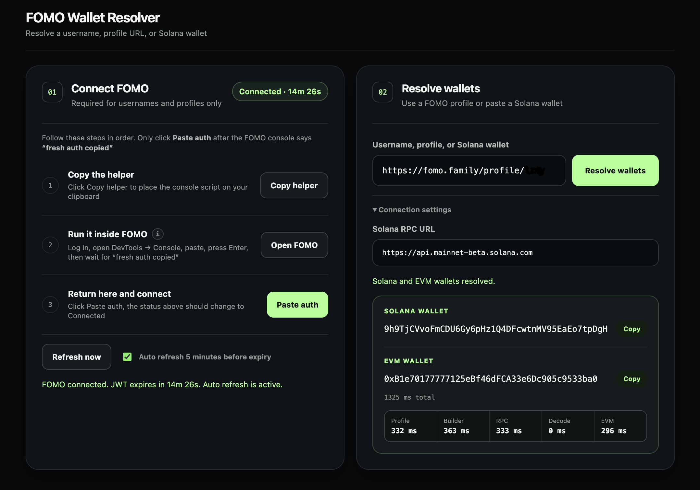

# FOMO wallet resolver

An unofficial Rust tool that resolves FOMO profiles to Solana wallets and,
when verified Relay history exists, EVM wallets. It can also resolve EVM
wallets directly from Solana addresses. Nothing is signed or submitted.

Unofficial, noncommercial research project. Not affiliated with or endorsed by
FOMO.



## Download

Precompiled builds are available on the
[Releases page](https://github.com/YvesxDev/fomo-wallet-resolver/releases) for
macOS Apple Silicon, macOS Intel, Windows x64, and Linux x64. Each archive has a
matching SHA-256 checksum.

The binaries are not notarized or publisher-signed, so macOS Gatekeeper or
Windows SmartScreen may ask for confirmation on first launch.

## Use it

Run the executable. It opens a local browser interface on a random `127.0.0.1`
port.

- **Solana address:** paste it directly. FOMO authentication and Solana RPC are
  not needed for a direct Solana-to-EVM lookup.
- **FOMO username or profile:** connect an existing signed-in FOMO session,
  then enter the username or full profile URL.

To connect FOMO:

1. Click **Copy helper** in the resolver.
2. Click **Open FOMO** and log in if needed.
3. Open DevTools, select **Console**, paste, and press Enter.
4. Wait for `FOMO Resolver: fresh auth copied`.
5. Return to the resolver and click **Paste auth**.

Do not click **Paste auth** immediately after copying the helper. The helper
must first run inside the FOMO console and replace the clipboard contents.
Authentication stays in process memory. The resolver refreshes it five minutes
before expiry and retries every 30 seconds when needed.

## How it resolves wallets

- FOMO's profile API supplies the user ID.
- FOMO prepares an unsigned USDC transfer for that user.
- The resolver decodes the transaction and reads the destination wallet from
  the ATA instruction or Solana RPC.
- EVM resolution requires a completed FOMO swap that matches Relay by sender,
  recipient, time, amount, fee, chains, tokens, and destination credit.
- Missing or conflicting evidence returns the Solana wallet without guessing an
  EVM wallet.

The prepared amount is 2 USDC because FOMO subtracts its dynamic fee from it.
The connected account does not need a USDC balance because the transaction is
never submitted.

See [How wallet resolution works](docs/how-it-works.md) for the complete method
and verification rules.

## Compile from source

Requires Rust 1.90 or newer.

```bash
git clone https://github.com/YvesxDev/fomo-wallet-resolver.git
cd fomo-wallet-resolver
cargo build --release
./target/release/fomo-wallet-resolver
```

## CLI

Reusable authenticated session:

```bash
./target/release/fomo-wallet-resolver --session --timings
```

Single authenticated profile lookup:

```bash
read -s FOMO_BEARER_TOKEN
export FOMO_BEARER_TOKEN
./target/release/fomo-wallet-resolver --timings <HANDLE_OR_PROFILE_URL>
```

Direct Solana-to-EVM lookup:

```bash
./target/release/fomo-wallet-resolver --timings <SOLANA_WALLET>
```

`SOLANA_RPC_URL` overrides the default `https://api.mainnet-beta.solana.com`
RPC. Run the executable with `--help` for every option.

## Safety

- No private keys or wallet signatures are requested.
- No transaction is signed, broadcast, or submitted.
- Browser authentication is not saved to disk or printed by the resolver.
- The local server binds only to `127.0.0.1` and sends no-store responses.
- Clipboard history or sync tools may retain copied session credentials. Avoid
  the authentication flow on shared machines and clear clipboard history when
  necessary.
- FOMO and Privy use internal APIs here, so upstream changes may require an
  update.

## Development

```bash
cargo fmt --check
cargo test --all-targets
cargo clippy --all-targets -- -D warnings
cargo build --release
node --check browser-console.js
node --check ui/app.js
```

## License

MIT. See [LICENSE](LICENSE).
